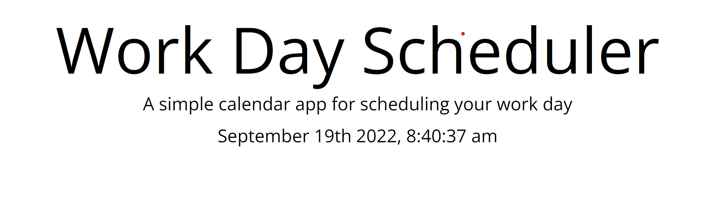
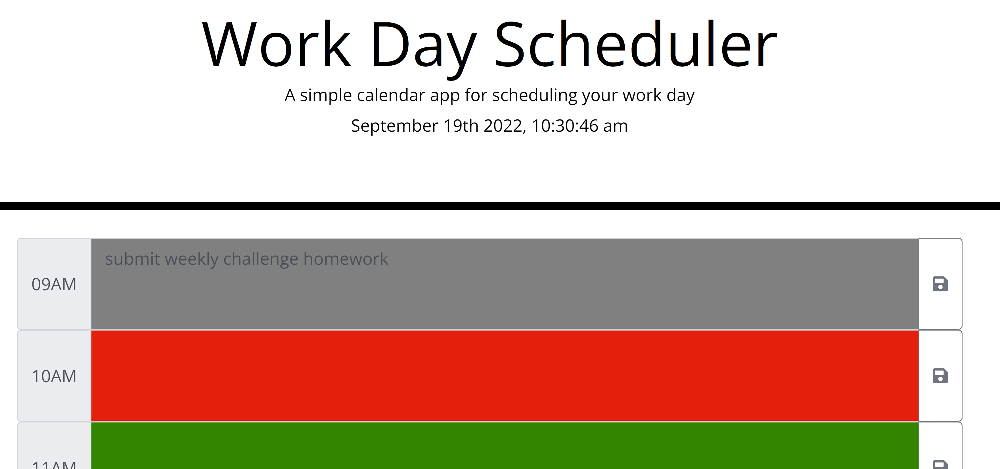
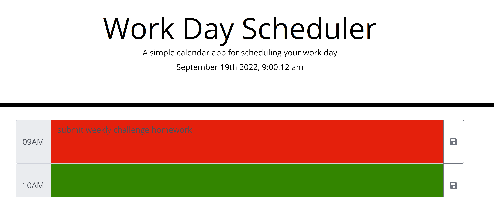
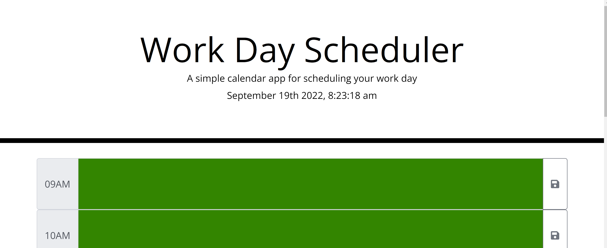
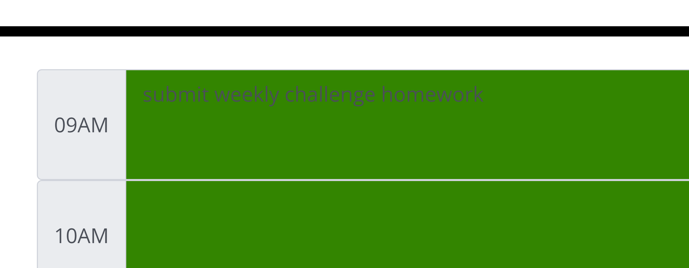
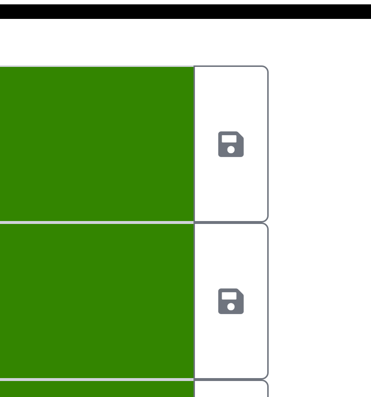

# Daily Planner

This project was created for the University of Denver coding bootcamp.
I created this as a resource to use as a way to plan out your day.

## Usage

When using this planner, you will first see the current date along with the current hour, including seconds. This automatically updates every second.

Next you will see the hours for the daily planner, from 9am to 5pm. If a box is grey, it means that hour has already passed.

If a box is read, it means that it is currently that hour.

If a box is green, it means that hour has not occured yet and is in the future.

Each box has the functionality to type in. This is how a user will plan out their day using the corresponding box next to each hour.

To save what is written, the user has to click the save icon next to the corresponding text box.

